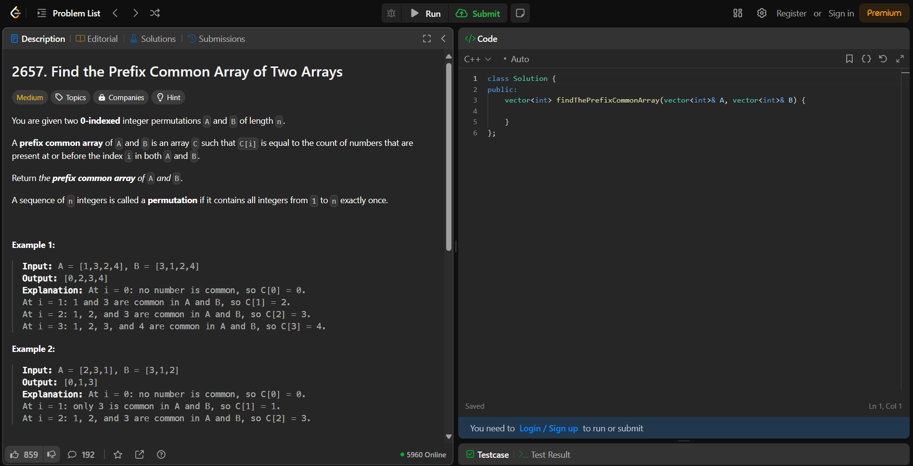
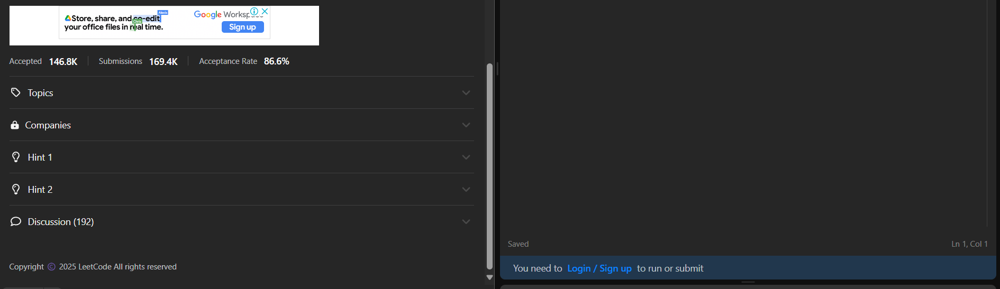
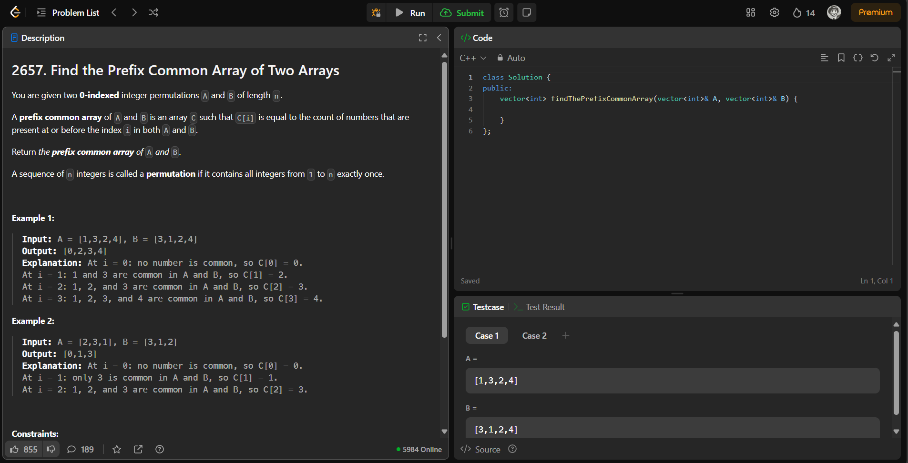
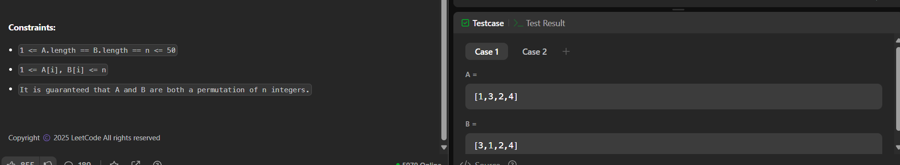

# LeetCode Enhancer Extension

A Chrome extension designed to enhance your LeetCode experience by disabling distractions such as solutions, discussions, solved counters, and other helper elements. This extension helps you focus solely on solving problems without unnecessary distractions.

---

## Features

-   **Disables Solutions**: Hides the "Solutions" tab to prevent accidental spoilers.
-   **Removes Discussions**: Hides the "Discuss" tab to avoid distractions.
-   **Hides Solved Counters**: Removes the solved counters (e.g., "X users solved this problem") to reduce pressure.
-   **Disables Other Helpers**: Hides additional helper elements like hints, related topics, and difficulty tags.
-   **Persistent Settings**: Saves your preferences across sessions, so you don’t have to reconfigure the extension every time.

---

## Installation

1. Download the extension files from the [GitHub repository](https://github.com/NotTheRightGuy/hardcore-leetcode-extension).
2. Extract the ZIP file to a folder on your computer.
3. Open Chrome and go to `chrome://extensions/`.

-   In case of edge, go to `edge://extensions/`.

4. Enable **Developer mode** by toggling the switch in the top right corner.
5. Click **Load unpacked** and select the folder where you extracted the extension files.

---

## Usage

1. After installing the extension, navigate to any problem page on [LeetCode](https://leetcode.com).
2. The extension will automatically hide the following elements:
    - **Solutions tab**
    - **Discuss tab**
    - **Solved counters**
    - **Hints and helper elements**

---

## How It Works

The extension uses **content scripts** to manipulate the DOM of LeetCode pages and hide specific elements. It also uses **Chrome Storage** to save your preferences, ensuring that your settings persist across sessions.

---

## Contributing

Contributions are welcome! If you’d like to contribute to this project, please follow these steps:

1. Fork the repository.
2. Create a new branch for your feature or bug fix.
3. Make your changes and test thoroughly.
4. Submit a pull request with a detailed description of your changes.

---

## Support

If you encounter any issues or have suggestions for improvement, please open an issue on the [GitHub repository](https://github.com/NotTheRightGuy/hardcore-leetcode-extension).

---

## Screenshots

### Before Using the Extension

### After Using the Extension

---

## Acknowledgments

-   Inspired by the need to focus on problem-solving without distractions.
-   Built with ❤️ for the LeetCode community.

---

Enjoy a distraction-free LeetCode experience with **LeetCode Enhancer**! 🚀

---
